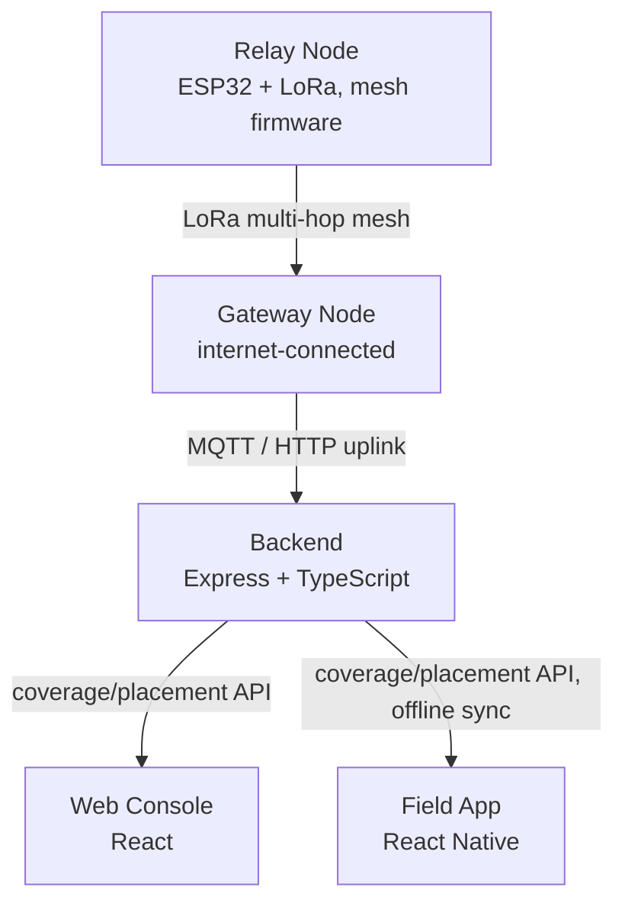

# System Overview

See [[Home]] for the vault index.

## Components

| Component | Owner | Stack | Notes |
|---|---|---|---|
| Relay/gateway node firmware | [[Teams/Firmware\|Firmware]] | ESP32-S3, PlatformIO, Meshtastic/MeshCore | Gateway is a relay node that also uplinks status data |
| Backend API | [[Teams/Web\|Web]] | Express, TypeScript | Placement algorithm + coverage-gap detection live here — see `web/backend/src/services/` |
| Web console | [[Teams/Web\|Web]] | React, TypeScript, Vite | Live map for whoever is directing the deployment |
| Field app | [[Teams/Mobile\|Mobile]] | React Native, TypeScript | Used by the responder physically placing nodes; offline-first |

## Shared contract

All four components need to agree on the node/coverage/telemetry shape. That contract lives in `shared/` (TypeScript types, importable by backend/web/mobile) and `shared/docs/mqtt-payload-schema.md` (the plain-language version firmware, being C, implements against). Update the schema doc first when the contract changes.

## Why this shape

See the relevant ADRs for the reasoning behind specific choices:
- [[Decisions/0003-use-express-for-backend|Why Express for the backend]]
- [[Decisions/0004-use-react-native-for-mobile|Why React Native for the field app]]
